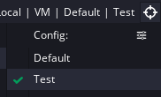

# CONFIG FILE GUIDE

Setting up an adam configuration file is simple, and allows users to have simple `adam run` commands without passing in any complicated information.

Users have two format options: `JSON` and `TOML`. `TOML` is recommended for its simplicity, but `JSON` is fine as well. A configuration file must be named `.adam`, `.adam.json`/`.adam.toml`, or `adam.json`/`adam.toml`. If you include the file ending, make sure you're using the correct format (ie -- use JSON with the `.json` ending). All adam configuration files should be placed in the root folder of a project, alongside the Yyp. In the future, the CLI will allow users to pass in a config file by name.

Every option available in the CLI, except `--yyc`, is available in the configuration files. For how the CLI and the configuration files interact, see the section **How the CLI and Config Files interact** below. Each option available to users will be written below.

## Example

Here is an adam configuration file written in `TOML` and in `JSON`:

```toml
configuration = "debug"
ignore_cache = 1
verbosity = 1
output_folder = "output"
```

```json
{
    "configuration": "debug",
    "ignore_cache": 1,
    "verbosity": 1,
    "output_folder": "output"
}
```

This file could be named simple `.adam`, which will prompt `adam` to dynamically figure out if it's a `JSON` or `TOML` file, or it could be labelled `.adam.toml` for the `TOML` or `.adam.json` for the `JSON`.

## Options

Each option is written below. If a configuration file does not parse correctly, you will receive an error, though the compilation may or may not continue, depending on the severity of the error.

### configuration

> Type: String
>
> Default: "Default"

The Gms2 configuration to use. This is the configuration normally assigned in the IDE using this dropdown:



```toml
configuration = "Test"
```

```json
{
    "configuration": "Test"
}
```

### yyp

> Type: String
>
> Default: N/A

The target yyp **project name**. This is the value of the `name` field found in any `.yyp` file.

If not assigned, will use a Yyp if found in the directory. Required if there are multiple Yyps.

```toml
yyp = "UnitTest"
```

```json
{
    "yyp": "UnitTest"
}
```

### verbosity

> Type: Number
>
> Defaults: 0

The verbosity to use in the compiler. >1 disable the pretty compile widget. >2 adds verbose logging for the initial stages of compilation. >3 enables all verbosity.

```toml
verbosity = 2
```

```json
{
    "verbosity": 3
}
```

### output_folder

> Type: String
>
> Default: "target"

The output folder, relative to the current working directory. Defaults to `target`.

```toml
output_folder = "output"
```

```json
{
    "output_folder": "output"
}
```

### ignore_cache

> Type: Number
>
> Default: 0

Ignore cache. >0 disables the quick run when no files have been changed. >1 disables caching entirely.

```toml
ignore_cache = 1
```

```json
{
    "ignore_cache": 1
}
```

### gms2_install_location

> Type: String
>
> Default Windows: C:/Program Files/GameMaker Studio 2/GameMaker.exe
> Default Mac: /Applications/GameMaker.app

Uses a non-standard Gms2 install location. If you have installed Gms2 with Steam, this is required.

**Windows**: please make sure to either escape backslashes, or just use forward slashes.
**Mac**: please provide a path just to the `.app` file. Do not index within the `.app` file -- adam will handle that.

```toml
gms2_install_location = "C:/Program Files/Steam/common/GameMaker Studio 2/GameMaker.exe"
```

```json
{
    "gms2_install_location": "C:/Program Files/Steam/common/GameMaker Studio 2/GameMaker.exe"
}
```

### test_env_variables

> Type: Vec<String>
>
> Default Windows: []
> Default Mac: []

Sets environment variables when running `adam test`. `adam test` is the same as `adam run`, but with
these environment variables set.

```toml
test_env_variables = ["TEST_ENV_VARIABLE"]
```

```json
{
    "test_env_variables": ["TEST_ENV_VARIABLE"]
}
```

## How the CLI and Config Files Interact

Options passed into the CLI and the Config Files are **additive**, but in the case of conflicts, the CLI wins. This will allow users, for example, to set their default configuration as `"Debug"`, but pass in `-c "Release"` during times when they would like to change their configuration temporarily.

As a full example, if a configuration file like this is created:

```toml
# .adam.toml

configuration = "Debug"
verbosity = 1
```

And a user runs adam with:

```txt
adam run --ignore-cache --yyc -c "Release"
```

Then the configuration will be "Release", not "Debug". Additionally, the verbosity will be set to 1 still, as the CLI did not override that.

If this document is not clear, or if it develops any inaccuracies, please submit a bug report.
